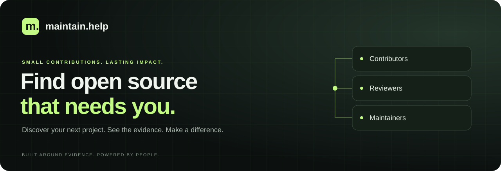

<p align="center">
  
</p>

<p align="center">
  Discover projects looking for contributors, reviewers, maintainers, and documentation help.<br>
  <strong>Find where you can help. Understand why it matters.</strong>
</p>

<p align="center">
  
  
  
  
  
</p>

<p align="center">
  <a href="#what-you-can-do">Features</a> &nbsp;·&nbsp;
  <a href="#how-it-works">How it works</a> &nbsp;·&nbsp;
  <a href="#run-it-locally">Quick start</a> &nbsp;·&nbsp;
  <a href="#development">Development</a> &nbsp;·&nbsp;
  <a href="#operations">Operations</a>
</p>

---

## A little help goes a long way

Your next contribution could be a first pull request, a documentation fix, a review, or a long-term maintainer role. **maintain.help** brings those opportunities together, with source links and activity signals that explain why a project appears.

Explicit requests, inferred capacity pressure, and verified maintainer updates each carry their own context. You can read the evidence before deciding where to spend your time.

## What you can do

| | Find your next contribution |
| :--- | :--- |
| **⌕ Explore** | Browse projects seeking maintainers, asking for help, or looking for documentation and PR review support. |
| **↗ Find a match** | Filter by your languages, the kind of help you want to give, and your experience level. |
| **◎ See the evidence** | Inspect source links, confidence levels, activity charts, and open opportunities. |
| **＋ Add a project** | Submit a GitHub repository for analysis and discovery. |
| **♡ Keep a shortlist** | Sign in with GitHub to save repositories and return to them later. |
| **✓ Speak as a maintainer** | Verify your repository permissions, claim a project, and state what help you need. |

## How it works

```text
GitHub repository       Evidence & activity       A place to contribute
─────────────────       ──────────────────       ─────────────────────
README / CONTRIBUTING   Explicit requests         Help categories
Issues / discussions →  Capacity signals       →  Status & confidence
Pull requests / commits Beginner friendliness    Source links & matches
```

The analysis uses explainable rules to combine maintainer statements, issue labels, backlogs, and contributor activity. Results include the signals behind them.

| Status | What it means |
| :--- | :--- |
| **Seeking maintainers** | An explicit request for maintainers, co-maintainers, or a successor. |
| **Actively asking** | A direct request for help or open issues with contribution labels. |
| **Likely needs help** | Activity suggests capacity pressure; the result carries an inferred confidence level. |
| **Maintenance mode** | The repository declares maintenance mode or GitHub marks it as archived. |
| **Healthy** | The analysis found no significant capacity pressure, or the maintainer says they are not looking for help. |

> **Maintainers have the final say.** A verified maintainer's self-reported status takes precedence over the automated classification.

## Run it locally

Use **Node.js 22.12+ in the 22.x line, or Node.js 24+**, npm, a PostgreSQL database, and a Clerk application with GitHub sign-in enabled.

### 1. Get the project

```bash
git clone https://github.com/byalex33/maintain.help.git
cd maintain.help
npm ci
```

### 2. Set the environment

Copy [`.env.example`](.env.example) to `.env`, then fill in your credentials.

| Variable | Purpose |
| :--- | :--- |
| `DATABASE_URL` | PostgreSQL connection string. |
| `NEXT_PUBLIC_CLERK_PUBLISHABLE_KEY` | Clerk's browser-safe publishable key. |
| `CLERK_SECRET_KEY` | Clerk's server-side secret key. |
| `GITHUB_ANALYSIS_TOKEN` | Server-side GitHub token for public repository ingestion. |
| `PRISMA_DEV_DATABASE` | Set to `true` only for the embedded `prisma dev` database; otherwise leave `false`. |
| `ADMIN_GITHUB_LOGINS` | Comma-separated GitHub logins allowed to use admin tools. |
| `CRON_SECRET` | Bearer secret for scheduled analysis requests. |

In Clerk, enable **GitHub only** and disable other sign-in methods. See the authentication notes below for production setup and repository claims. Local `.env` files are ignored by Git.

### 3. Prepare the database and start

```bash
npm run db:migrate
npm run db:generate
npm run db:seed
npm run dev
```

Open **[localhost:3000](http://localhost:3000)**. The seed command adds development fixtures so you can explore the interface immediately. Add a repository to analyze live GitHub data.

<details>
<summary><strong>Using the embedded local database</strong></summary>

Run `npm run db:dev` in a separate terminal. Copy its TCP database URL into `DATABASE_URL` and set `PRISMA_DEV_DATABASE="true"` before preparing the database.

This flag configures one connection per process and promptly closes idle connections. Prisma v7's `pg` adapter needs these pool options explicitly; the old `connection_limit` URL parameter does not configure its pool. Restart Next.js after changing the flag.

If builds or restarts lead to `Connection terminated unexpectedly`, stop the embedded server with `npx prisma dev stop default`, then restart it with `npm run db:dev`. Its socket layer can retain stale connection slots while the port is still listening. Restarting preserves data; do not reset or remove the database.

</details>

## Development

| Command | What it does |
| :--- | :--- |
| `npm run dev` | Start the Next.js development server. |
| `npm test` | Run the Vitest test suite. |
| `npm run test:watch` | Run tests in watch mode. |
| `npm run typecheck` | Check TypeScript types. |
| `npm run lint` | Run ESLint. |
| `npm run build` | Build the production application. |
| `npm start` | Serve the production build. |
| `npm run analyze:repo -- owner/repo` | Ingest one repository and print its analysis. |
| `npm run calibrate:ingest` | Ingest the controlled repository set in `scripts/calibrate-ingest.ts`. |

### Under the hood

**Next.js App Router · React · TypeScript · Tailwind CSS · Radix UI · Recharts**<br>
**PostgreSQL · Prisma · Clerk · Octokit · Vitest**

```text
src/
├── app/              Pages, server actions, and API routes
├── components/       Discovery, repository, authentication, and UI components
└── lib/
    ├── detection/    Evidence, metrics, scoring, and classification
    ├── github/       GitHub data, discovery, and permissions
    └── queries/      Repository browsing and matching
prisma/               Schema, migrations, and development fixtures
scripts/              Repository analysis and calibration tools
tests/                Authentication, detection, GitHub, and validation tests
```

## Operations

Vercel omits sensitive secret values from environment exports. Check the project environment metadata and authenticated runtime behavior before treating an empty exported value as a missing secret.

<details>
<summary><strong>Authentication &amp; repository claims</strong></summary>

`/sign-in` uses Clerk's UI components, and `src/proxy.ts` establishes sessions. Discovery is public; server actions and API routes enforce permissions for protected operations. GitHub sign-up uses the same screen.

Claim checks retrieve the current user's GitHub OAuth token from Clerk on the server. Keep `GITHUB_ANALYSIS_TOKEN` separate: it handles public repository ingestion and never substitutes for user permissions. Only the Clerk publishable key belongs in browser code.

For production, create a Clerk production instance, configure the maintain.help domain and GitHub connection using Clerk's callback URL, and set that instance's keys in the hosting environment. Clerk's development GitHub connection uses shared credentials by default. Do not add private-repository scopes for public discovery; organization OAuth policies can still require an owner to approve claim checks.

**Existing installations:** the Clerk migration adds a nullable, unique `User.clerkId`. On first sign-in, the verified GitHub numeric ID links the existing local user, preserving saves, claims, and reviews. Email and username are never used to merge accounts. Legacy authentication tables remain inert; old sessions, stored OAuth tokens, and NextAuth environment variables are no longer used. A GitHub identity linked to a different Clerk user fails closed and requires deliberate administrative reconciliation.

</details>

<details>
<summary><strong>Admin tools &amp; scheduled analysis</strong></summary>

| Route | Access and purpose |
| :--- | :--- |
| `/admin` | Repository moderation for users in `ADMIN_GITHUB_LOGINS`: search listings, view reports, lock/unlock, delete/restore. |
| `/admin/calibration` | Redirects to `/admin`. |
| `/api/admin/ingest` | Admin-only ingestion of a bounded repository list or GitHub search query. |
| `/api/cron/analyze-repositories` | Scheduled analysis; requires `Authorization: Bearer $CRON_SECRET`. |

[`vercel.json`](vercel.json) configures the analysis cron to run every six hours.

Successful analyses are reused for one hour. Database leases prevent concurrent imports of the same repository, and failed analyses retry with a one-to-24-hour backoff. Apply migrations before running the updated ingestion pipeline.

For optional database checks, set `TEST_DATABASE_URL` to a migrated test database and run `npm test`. Native PostgreSQL runs the concurrency checks; the embedded development database runs the single-session lease check and skips multi-session locking tests.

</details>

<details>
<summary><strong>Production database &amp; build</strong></summary>

Configure the production database and authentication environment, leave `PRISMA_DEV_DATABASE` false, then run:

```bash
npx prisma migrate deploy
npm run db:generate
npm run build
npm start
```

The development fixture seed is optional for local exploration and is not part of the production setup.

</details>

---

<p align="center">
  <strong>Open source runs on people who show up.</strong><br>
  <sub>Find a project. Lend a hand.</sub>
</p>
